# Serial MCP Server - Theory of Operation

This document provides a comprehensive technical explanation of how the Serial MCP Server operates, including architecture, data flows, state management, and internal mechanisms.

## Table of Contents

1. [System Overview](#system-overview)
2. [Architecture](#architecture)
3. [MCP Protocol Integration](#mcp-protocol-integration)
4. [Connection Lifecycle](#connection-lifecycle)
5. [Data Flow](#data-flow)
6. [Thread Safety and Concurrency](#thread-safety-and-concurrency)
7. [Session Management](#session-management)
8. [Error Handling](#error-handling)
9. [Configuration System](#configuration-system)
10. [Tool Implementation Details](#tool-implementation-details)

---

## System Overview

The Serial MCP Server is a Rust-based Model Context Protocol (MCP) server that bridges AI assistants (like Claude) with physical serial port devices. It enables AI systems to discover, connect to, and communicate with embedded hardware such as STM32 microcontrollers, Arduino boards, and other UART-capable devices.

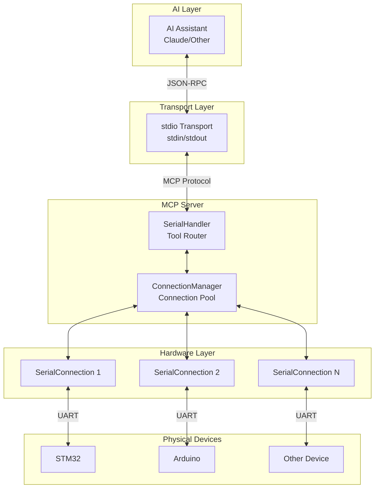
```mermaid
graph TB
    subgraph "AI Layer"
        AI[AI Assistant<br/>Claude/Other]
    end

    subgraph "Transport Layer"
        STDIO[stdio Transport<br/>stdin/stdout]
    end

    subgraph "MCP Server"
        SH[SerialHandler<br/>Tool Router]
        CM[ConnectionManager<br/>Connection Pool]
    end

    subgraph "Hardware Layer"
        SC1[SerialConnection 1]
        SC2[SerialConnection 2]
        SCN[SerialConnection N]
    end

    subgraph "Physical Devices"
        DEV1[STM32]
        DEV2[Arduino]
        DEVN[Other Device]
    end

    AI <-->|JSON-RPC| STDIO
    STDIO <-->|MCP Protocol| SH
    SH <--> CM
    CM <--> SC1
    CM <--> SC2
    CM <--> SCN
    SC1 <-->|UART| DEV1
    SC2 <-->|UART| DEV2
    SCN <-->|UART| DEVN
```

---

## Architecture

### Module Structure

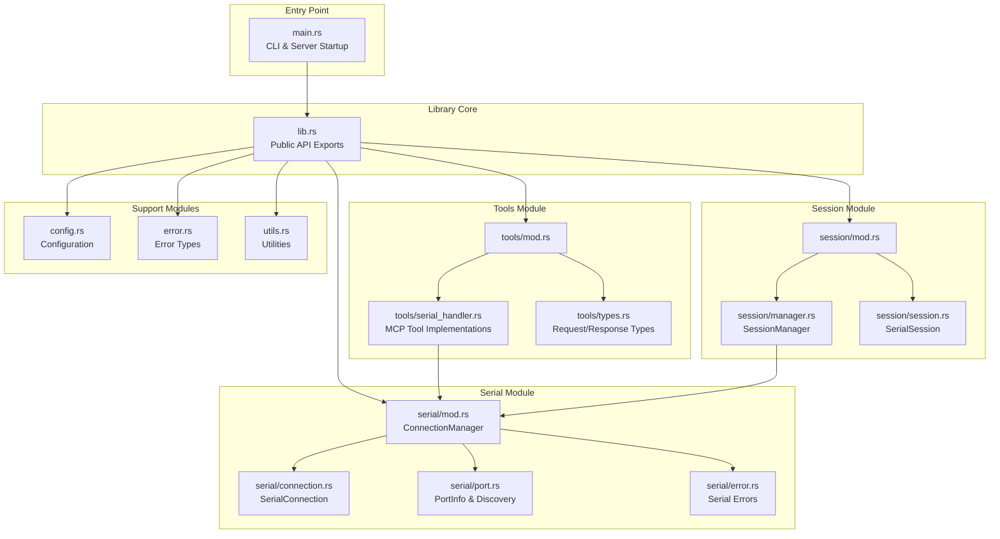
```mermaid
graph TD
    subgraph "Entry Point"
        MAIN[main.rs<br/>CLI & Server Startup]
    end

    subgraph "Library Core"
        LIB[lib.rs<br/>Public API Exports]
    end

    subgraph "Tools Module"
        TM[tools/mod.rs]
        TSH[tools/serial_handler.rs<br/>MCP Tool Implementations]
        TT[tools/types.rs<br/>Request/Response Types]
    end

    subgraph "Serial Module"
        SM[serial/mod.rs<br/>ConnectionManager]
        SC[serial/connection.rs<br/>SerialConnection]
        SP[serial/port.rs<br/>PortInfo & Discovery]
        SE[serial/error.rs<br/>Serial Errors]
    end

    subgraph "Session Module"
        SESS[session/mod.rs]
        SESM[session/manager.rs<br/>SessionManager]
        SESH[session/session.rs<br/>SerialSession]
    end

    subgraph "Support Modules"
        CFG[config.rs<br/>Configuration]
        ERR[error.rs<br/>Error Types]
        UTL[utils.rs<br/>Utilities]
    end

    MAIN --> LIB
    LIB --> TM
    LIB --> SM
    LIB --> SESS
    LIB --> CFG
    LIB --> ERR
    LIB --> UTL

    TM --> TSH
    TM --> TT
    TSH --> SM

    SM --> SC
    SM --> SP
    SM --> SE

    SESS --> SESM
    SESS --> SESH
    SESM --> SM
```

### Key Components

| Component | Location | Responsibility |
|-----------|----------|----------------|
| `SerialHandler` | `tools/serial_handler.rs` | Implements MCP tools, routes requests |
| `ConnectionManager` | `serial/mod.rs` | Manages pool of active connections |
| `SerialConnection` | `serial/connection.rs` | Wraps individual serial port streams |
| `PortInfo` | `serial/port.rs` | Discovers and describes available ports |
| `SessionManager` | `session/manager.rs` | Higher-level session lifecycle management |
| `Config` | `config.rs` | Configuration loading and validation |

---

## MCP Protocol Integration

### Server Initialization Sequence

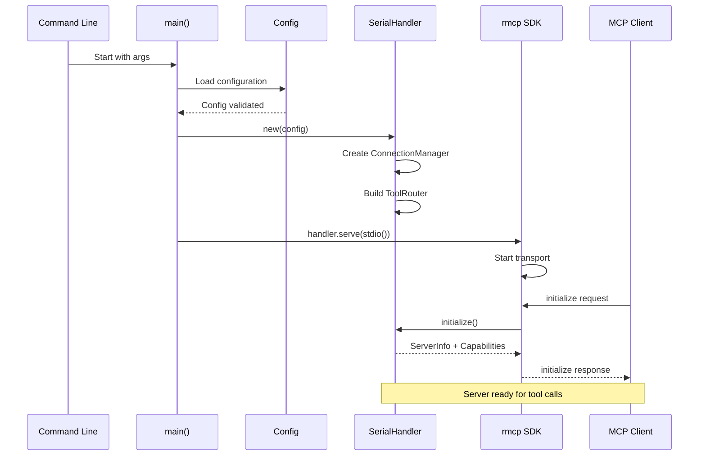
```mermaid
sequenceDiagram
    participant CLI as Command Line
    participant Main as main()
    participant Config as Config
    participant Handler as SerialHandler
    participant RMCP as rmcp SDK
    participant Client as MCP Client

    CLI->>Main: Start with args
    Main->>Config: Load configuration
    Config-->>Main: Config validated
    Main->>Handler: new(config)
    Handler->>Handler: Create ConnectionManager
    Handler->>Handler: Build ToolRouter
    Main->>RMCP: handler.serve(stdio())
    RMCP->>RMCP: Start transport

    Client->>RMCP: initialize request
    RMCP->>Handler: initialize()
    Handler-->>RMCP: ServerInfo + Capabilities
    RMCP-->>Client: initialize response

    Note over Client,Handler: Server ready for tool calls
```

### Tool Registration

The server uses the `rmcp` SDK's macro system for tool registration:

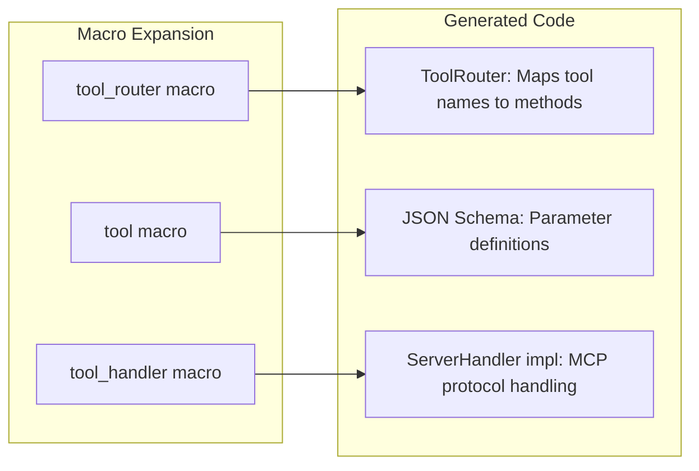
```mermaid
graph LR
    subgraph "Macro Expansion"
        TR["tool_router macro"]
        TM["tool macro"]
        TH["tool_handler macro"]
    end

    subgraph "Generated Code"
        ROUTER["ToolRouter: Maps tool names to methods"]
        SCHEMA["JSON Schema: Parameter definitions"]
        HANDLER["ServerHandler impl: MCP protocol handling"]
    end

    TR --> ROUTER
    TM --> SCHEMA
    TH --> HANDLER
```

### Available Tools

| Tool Name | Parameters | Description |
|-----------|------------|-------------|
| `list_ports` | None | Enumerate available serial ports |
| `open` | port, baud_rate, data_bits, stop_bits, parity, flow_control | Open a connection |
| `write` | connection_id, data, encoding | Send data to device |
| `read` | connection_id, timeout_ms, max_bytes, encoding | Receive data from device |
| `close` | connection_id | Terminate connection |

---

## Connection Lifecycle

### State Diagram

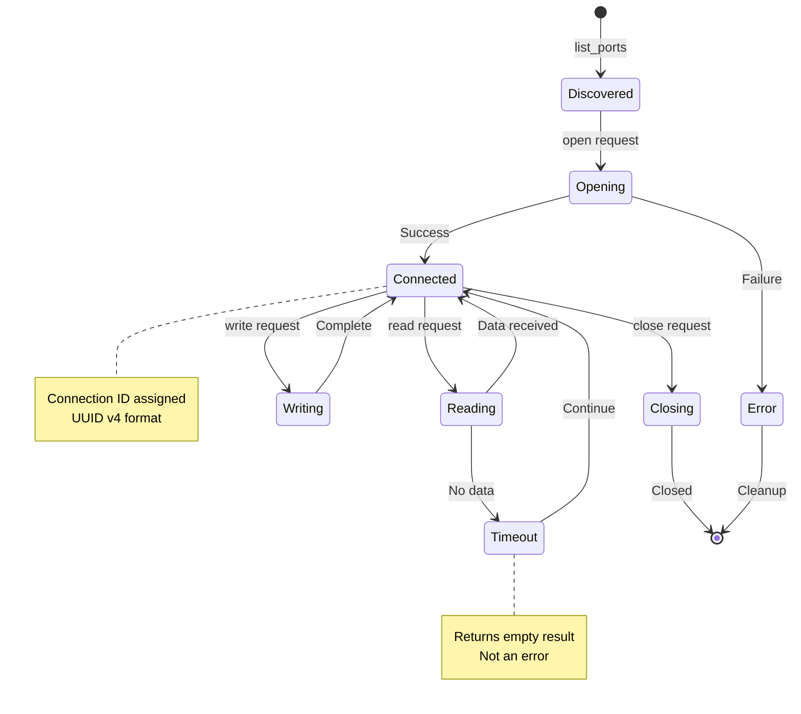
```mermaid
stateDiagram-v2
    [*] --> Discovered: list_ports
    Discovered --> Opening: open request
    Opening --> Connected: Success
    Opening --> Error: Failure
    Connected --> Writing: write request
    Connected --> Reading: read request
    Writing --> Connected: Complete
    Reading --> Connected: Data received
    Reading --> Timeout: No data
    Timeout --> Connected: Continue
    Connected --> Closing: close request
    Closing --> [*]: Closed
    Error --> [*]: Cleanup

    note right of Connected: Connection ID assigned<br/>UUID v4 format
    note right of Timeout: Returns empty result<br/>Not an error
```

### Connection Open Process

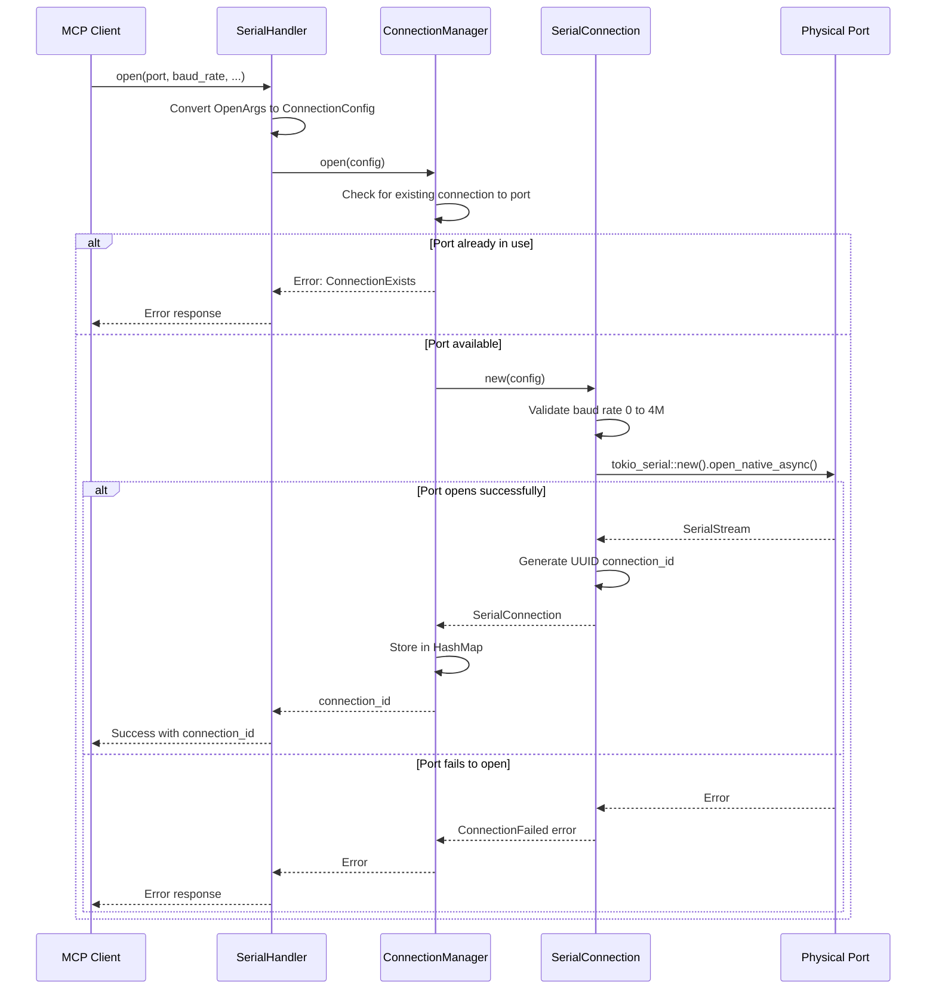
```mermaid
sequenceDiagram
    participant Client as MCP Client
    participant Handler as SerialHandler
    participant CM as ConnectionManager
    participant SC as SerialConnection
    participant Port as Physical Port

    Client->>Handler: open(port, baud_rate, ...)
    Handler->>Handler: Convert OpenArgs to ConnectionConfig
    Handler->>CM: open(config)

    CM->>CM: Check for existing connection to port
    alt Port already in use
        CM-->>Handler: Error: ConnectionExists
        Handler-->>Client: Error response
    else Port available
        CM->>SC: new(config)
        SC->>SC: Validate baud rate 0 to 4M
        SC->>Port: tokio_serial::new().open_native_async()

        alt Port opens successfully
            Port-->>SC: SerialStream
            SC->>SC: Generate UUID connection_id
            SC-->>CM: SerialConnection
            CM->>CM: Store in HashMap
            CM-->>Handler: connection_id
            Handler-->>Client: Success with connection_id
        else Port fails to open
            Port-->>SC: Error
            SC-->>CM: ConnectionFailed error
            CM-->>Handler: Error
            Handler-->>Client: Error response
        end
    end
```

### Connection Configuration

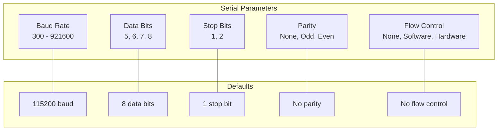
```mermaid
graph TD
    subgraph "Serial Parameters"
        BR[Baud Rate<br/>300 - 921600]
        DB[Data Bits<br/>5, 6, 7, 8]
        SB[Stop Bits<br/>1, 2]
        PA[Parity<br/>None, Odd, Even]
        FC[Flow Control<br/>None, Software, Hardware]
    end

    subgraph "Defaults"
        D1[115200 baud]
        D2[8 data bits]
        D3[1 stop bit]
        D4[No parity]
        D5[No flow control]
    end

    BR --- D1
    DB --- D2
    SB --- D3
    PA --- D4
    FC --- D5
```

---

## Data Flow

### Write Operation

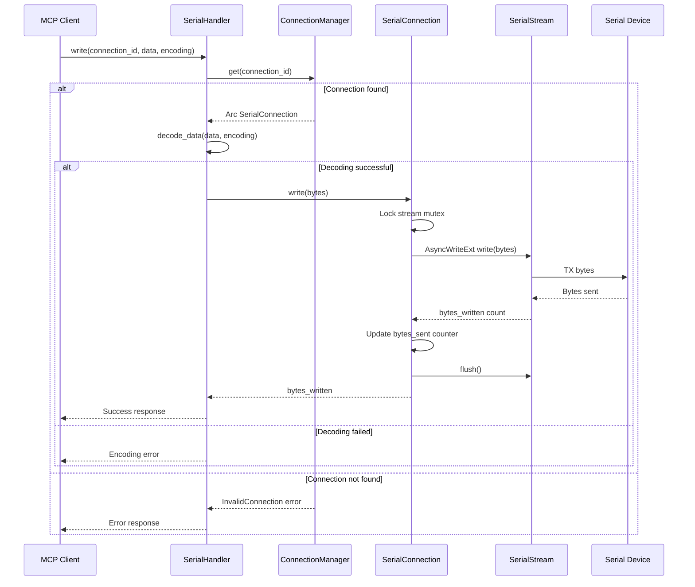
```mermaid
sequenceDiagram
    participant Client as MCP Client
    participant Handler as SerialHandler
    participant CM as ConnectionManager
    participant SC as SerialConnection
    participant Stream as SerialStream
    participant Device as Serial Device

    Client->>Handler: write(connection_id, data, encoding)
    Handler->>CM: get(connection_id)

    alt Connection found
        CM-->>Handler: Arc SerialConnection
        Handler->>Handler: decode_data(data, encoding)

        alt Decoding successful
            Handler->>SC: write(bytes)
            SC->>SC: Lock stream mutex
            SC->>Stream: AsyncWriteExt write(bytes)
            Stream->>Device: TX bytes
            Device-->>Stream: Bytes sent
            Stream-->>SC: bytes_written count
            SC->>SC: Update bytes_sent counter
            SC->>Stream: flush()
            SC-->>Handler: bytes_written
            Handler-->>Client: Success response
        else Decoding failed
            Handler-->>Client: Encoding error
        end
    else Connection not found
        CM-->>Handler: InvalidConnection error
        Handler-->>Client: Error response
    end
```

### Read Operation

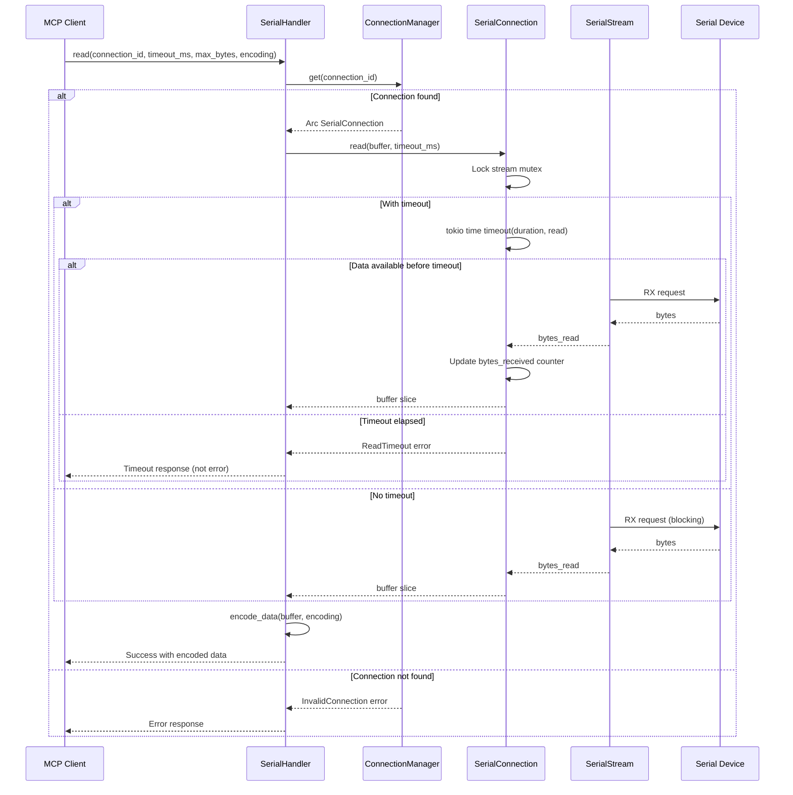
```mermaid
sequenceDiagram
    participant Client as MCP Client
    participant Handler as SerialHandler
    participant CM as ConnectionManager
    participant SC as SerialConnection
    participant Stream as SerialStream
    participant Device as Serial Device

    Client->>Handler: read(connection_id, timeout_ms, max_bytes, encoding)
    Handler->>CM: get(connection_id)

    alt Connection found
        CM-->>Handler: Arc SerialConnection
        Handler->>SC: read(buffer, timeout_ms)
        SC->>SC: Lock stream mutex

        alt With timeout
            SC->>SC: tokio time timeout(duration, read)

            alt Data available before timeout
                Stream->>Device: RX request
                Device-->>Stream: bytes
                Stream-->>SC: bytes_read
                SC->>SC: Update bytes_received counter
                SC-->>Handler: buffer slice
            else Timeout elapsed
                SC-->>Handler: ReadTimeout error
                Handler-->>Client: Timeout response (not error)
            end
        else No timeout
            Stream->>Device: RX request (blocking)
            Device-->>Stream: bytes
            Stream-->>SC: bytes_read
            SC-->>Handler: buffer slice
        end

        Handler->>Handler: encode_data(buffer, encoding)
        Handler-->>Client: Success with encoded data
    else Connection not found
        CM-->>Handler: InvalidConnection error
        Handler-->>Client: Error response
    end
```

### Data Encoding Pipeline

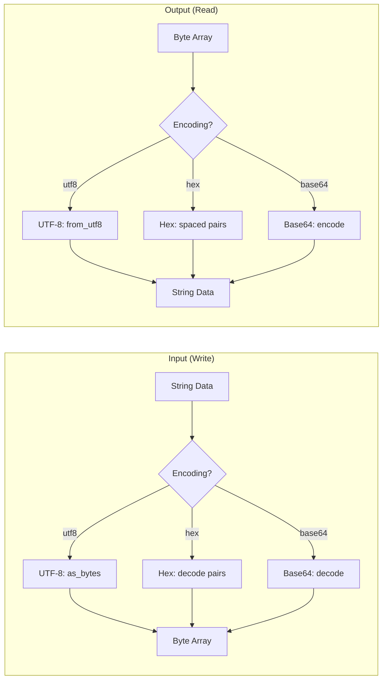
```mermaid
graph LR
    subgraph "Input (Write)"
        WI[String Data]
        WE{Encoding?}
        WU[UTF-8: as_bytes]
        WH[Hex: decode pairs]
        WB[Base64: decode]
        WO[Byte Array]
    end

    subgraph "Output (Read)"
        RI[Byte Array]
        RE{Encoding?}
        RU[UTF-8: from_utf8]
        RH[Hex: spaced pairs]
        RB[Base64: encode]
        RO[String Data]
    end

    WI --> WE
    WE -->|utf8| WU --> WO
    WE -->|hex| WH --> WO
    WE -->|base64| WB --> WO

    RI --> RE
    RE -->|utf8| RU --> RO
    RE -->|hex| RH --> RO
    RE -->|base64| RB --> RO
```

---

## Thread Safety and Concurrency

### Synchronization Primitives

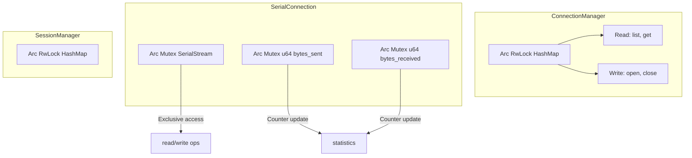
```mermaid
graph TD
    subgraph "ConnectionManager"
        CM_LOCK["Arc RwLock HashMap"]
        CM_READ["Read: list, get"]
        CM_WRITE["Write: open, close"]
    end

    subgraph "SerialConnection"
        SC_STREAM["Arc Mutex SerialStream"]
        SC_SENT["Arc Mutex u64 bytes_sent"]
        SC_RECV["Arc Mutex u64 bytes_received"]
    end

    subgraph "SessionManager"
        SM_SESSIONS["Arc RwLock HashMap"]
    end

    CM_LOCK --> CM_READ
    CM_LOCK --> CM_WRITE

    SC_STREAM --> |Exclusive access| R["read/write ops"]
    SC_SENT --> |Counter update| S["statistics"]
    SC_RECV --> |Counter update| S
```

### Concurrent Access Pattern

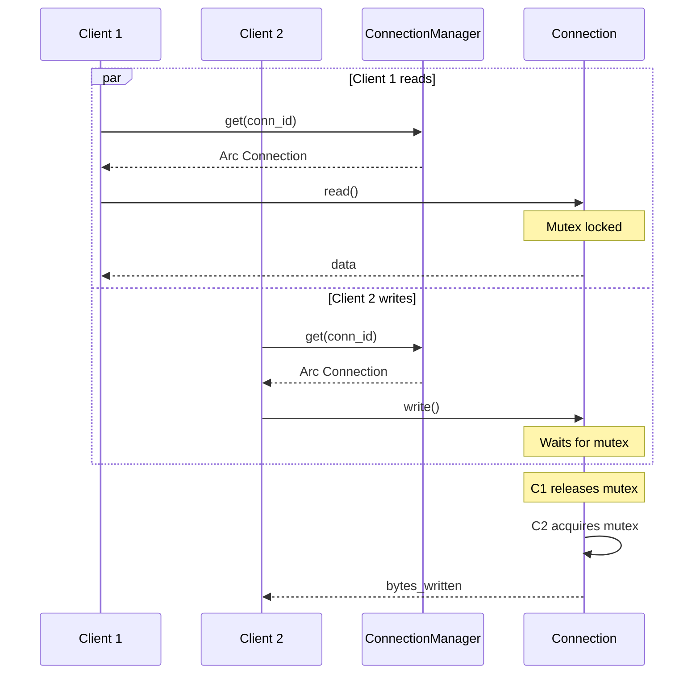
```mermaid
sequenceDiagram
    participant C1 as Client 1
    participant C2 as Client 2
    participant CM as ConnectionManager
    participant Conn as Connection

    par Client 1 reads
        C1->>CM: get(conn_id)
        CM-->>C1: Arc Connection
        C1->>Conn: read()
        Note over Conn: Mutex locked
        Conn-->>C1: data
    and Client 2 writes
        C2->>CM: get(conn_id)
        CM-->>C2: Arc Connection
        C2->>Conn: write()
        Note over Conn: Waits for mutex
    end

    Note over Conn: C1 releases mutex
    Conn->>Conn: C2 acquires mutex
    Conn-->>C2: bytes_written
```

---

## Session Management

### Session State Machine

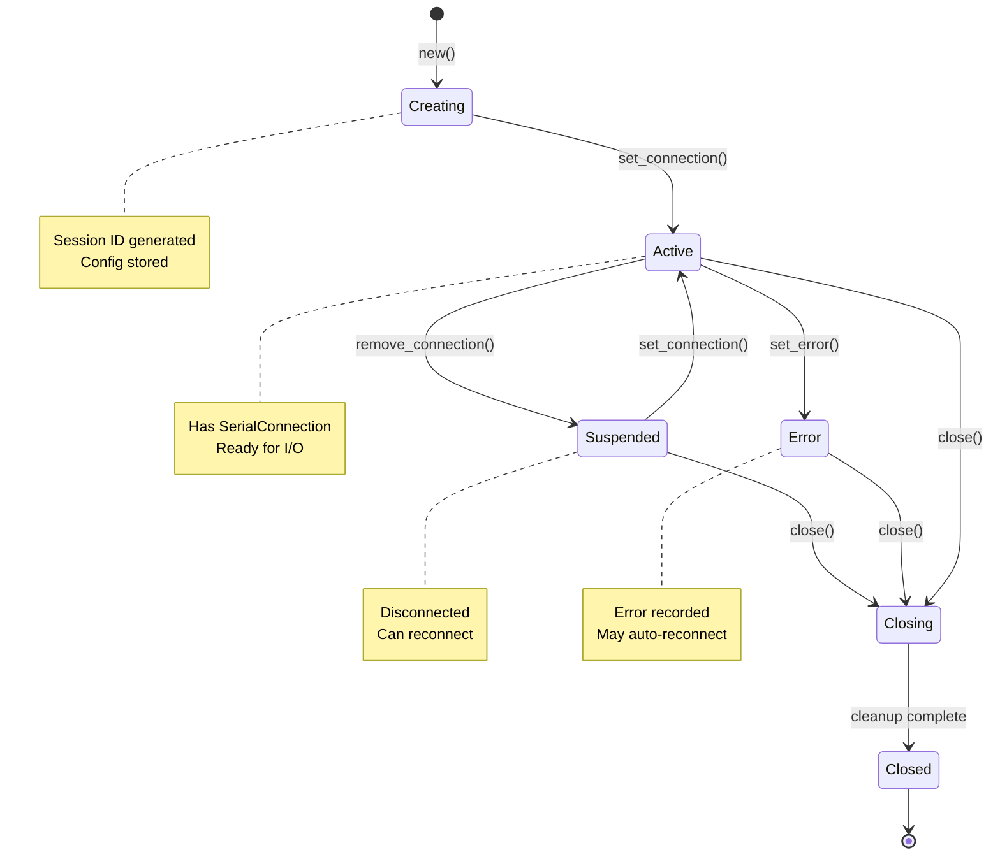
```mermaid
stateDiagram-v2
    [*] --> Creating: new()
    Creating --> Active: set_connection()
    Active --> Suspended: remove_connection()
    Active --> Error: set_error()
    Suspended --> Active: set_connection()
    Suspended --> Closing: close()
    Error --> Closing: close()
    Active --> Closing: close()
    Closing --> Closed: cleanup complete
    Closed --> [*]

    note right of Creating: Session ID generated<br/>Config stored
    note right of Active: Has SerialConnection<br/>Ready for I/O
    note right of Suspended: Disconnected<br/>Can reconnect
    note right of Error: Error recorded<br/>May auto-reconnect
```

### Session Manager Architecture

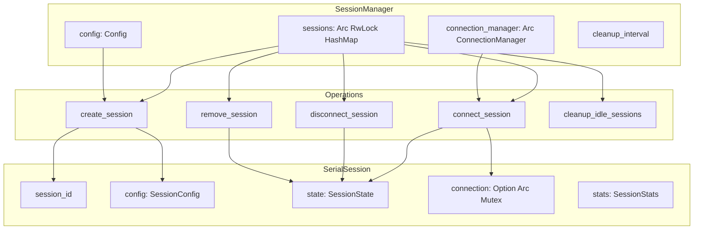
```mermaid
graph TB
    subgraph "SessionManager"
        SESSIONS["sessions: Arc RwLock HashMap"]
        CONN_MGR["connection_manager: Arc ConnectionManager"]
        CONFIG["config: Config"]
        CLEANUP["cleanup_interval"]
    end

    subgraph "Operations"
        CREATE["create_session"]
        CONNECT["connect_session"]
        DISCONNECT["disconnect_session"]
        REMOVE["remove_session"]
        CLEANUP_TASK["cleanup_idle_sessions"]
    end

    subgraph "SerialSession"
        SID["session_id"]
        SCONFIG["config: SessionConfig"]
        STATE["state: SessionState"]
        SCONN["connection: Option Arc Mutex"]
        STATS["stats: SessionStats"]
    end

    SESSIONS --> CREATE
    SESSIONS --> CONNECT
    SESSIONS --> DISCONNECT
    SESSIONS --> REMOVE
    SESSIONS --> CLEANUP_TASK

    CONN_MGR --> CONNECT
    CONFIG --> CREATE

    CREATE --> SID
    CREATE --> SCONFIG
    CONNECT --> STATE
    CONNECT --> SCONN
    DISCONNECT --> STATE
    REMOVE --> STATE
```

### Session Statistics Tracking

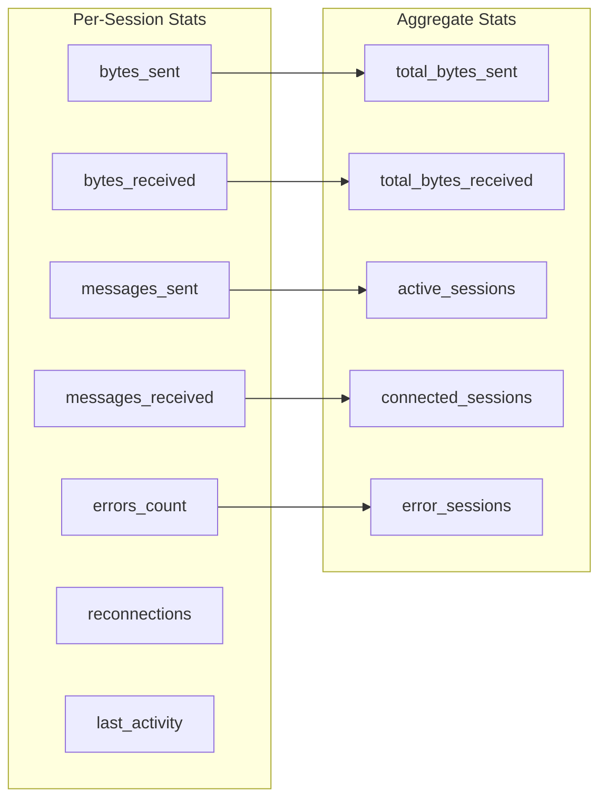
```mermaid
graph LR
    subgraph "Per-Session Stats"
        BS[bytes_sent]
        BR[bytes_received]
        MS[messages_sent]
        MR[messages_received]
        EC[errors_count]
        RC[reconnections]
        LA[last_activity]
    end

    subgraph "Aggregate Stats"
        TBS[total_bytes_sent]
        TBR[total_bytes_received]
        AS[active_sessions]
        CS[connected_sessions]
        ES[error_sessions]
    end

    BS --> TBS
    BR --> TBR
    MS --> AS
    MR --> CS
    EC --> ES
```

---

## Error Handling

### Error Hierarchy


```mermaid
graph TD
    subgraph "Main Error Type"
        SE[SerialError]
    end

    subgraph "Connection Errors"
        PNF[PortNotFound]
        CF[ConnectionFailed]
        IC[InvalidConnection]
        CE[ConnectionExists]
        CLE[ConnectionLimitExceeded]
    end

    subgraph "Communication Errors"
        OT[OperationTimeout]
        RT[ReadTimeout]
        WT[WriteTimeout]
        COMM[CommunicationError]
        PE[ProtocolError]
        BO[BufferOverflow]
    end

    subgraph "Configuration Errors"
        IVC[InvalidConfig]
        IBR[InvalidBaudRate]
        IDB[InvalidDataBits]
        ISB[InvalidStopBits]
        IP[InvalidParity]
        IFC[InvalidFlowControl]
    end

    subgraph "Encoding Errors"
        ENC[EncodingError]
        UTF[Utf8Error]
        HEX[HexError]
        B64[Base64Error]
    end

    SE --> PNF
    SE --> CF
    SE --> IC
    SE --> CE
    SE --> CLE

    SE --> OT
    SE --> RT
    SE --> WT
    SE --> COMM
    SE --> PE
    SE --> BO

    SE --> IVC
    SE --> IBR
    SE --> IDB
    SE --> ISB
    SE --> IP
    SE --> IFC

    SE --> ENC
    SE --> UTF
    SE --> HEX
    SE --> B64
```

### Error Recovery Strategy

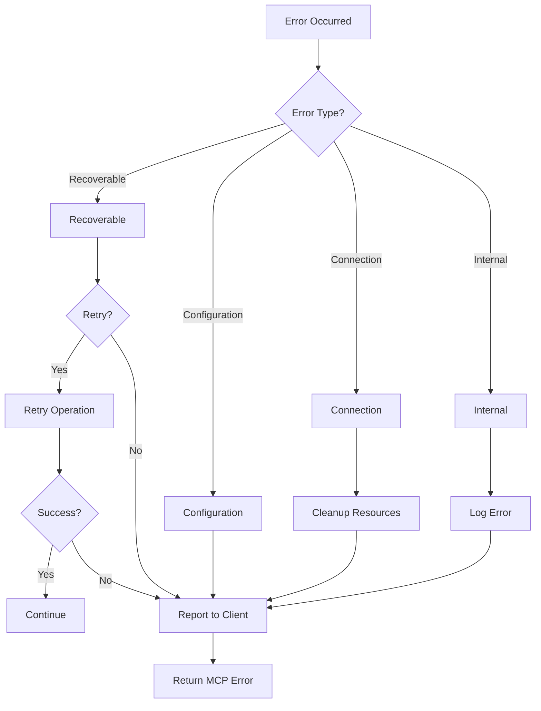
```mermaid
flowchart TD
    ERR[Error Occurred]

    ERR --> CHECK{Error Type?}

    CHECK -->|Recoverable| REC[Recoverable]
    CHECK -->|Configuration| CFG[Configuration]
    CHECK -->|Connection| CONN[Connection]
    CHECK -->|Internal| INT[Internal]

    REC --> RETRY{Retry?}
    RETRY -->|Yes| DO_RETRY[Retry Operation]
    RETRY -->|No| REPORT[Report to Client]
    DO_RETRY --> SUCCESS{Success?}
    SUCCESS -->|Yes| DONE[Continue]
    SUCCESS -->|No| REPORT

    CFG --> REPORT
    CONN --> CLEANUP[Cleanup Resources]
    CLEANUP --> REPORT
    INT --> LOG[Log Error]
    LOG --> REPORT

    REPORT --> MCP_ERR[Return MCP Error]
```

### Recoverable vs Non-Recoverable Errors

| Category | Recoverable | Examples |
|----------|-------------|----------|
| Timeout | Yes | ReadTimeout, WriteTimeout, OperationTimeout |
| Communication | Yes | CommunicationError, BufferOverflow |
| Configuration | No | InvalidBaudRate, InvalidConfig |
| Connection | No | PortNotFound, ConnectionExists |
| Internal | No | InternalError, NotImplemented |

---

## Configuration System

### Configuration Hierarchy

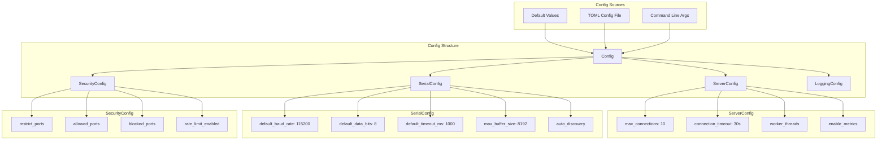
```mermaid
graph TD
    subgraph "Config Sources"
        CLI[Command Line Args]
        FILE[TOML Config File]
        DEF[Default Values]
    end

    subgraph "Config Structure"
        CFG[Config]
        SRV[ServerConfig]
        SER[SerialConfig]
        SEC[SecurityConfig]
        LOG[LoggingConfig]
    end

    subgraph "ServerConfig"
        MC[max_connections: 10]
        CT[connection_timeout: 30s]
        WT[worker_threads]
        EM[enable_metrics]
    end

    subgraph "SerialConfig"
        DBR[default_baud_rate: 115200]
        DDB[default_data_bits: 8]
        DT[default_timeout_ms: 1000]
        MBS[max_buffer_size: 8192]
        AD[auto_discovery]
    end

    subgraph "SecurityConfig"
        RP[restrict_ports]
        AP[allowed_ports]
        BP[blocked_ports]
        RL[rate_limit_enabled]
    end

    DEF --> CFG
    FILE --> CFG
    CLI --> CFG

    CFG --> SRV
    CFG --> SER
    CFG --> SEC
    CFG --> LOG

    SRV --> MC
    SRV --> CT
    SRV --> WT
    SRV --> EM

    SER --> DBR
    SER --> DDB
    SER --> DT
    SER --> MBS
    SER --> AD

    SEC --> RP
    SEC --> AP
    SEC --> BP
    SEC --> RL
```

### Configuration Loading Sequence

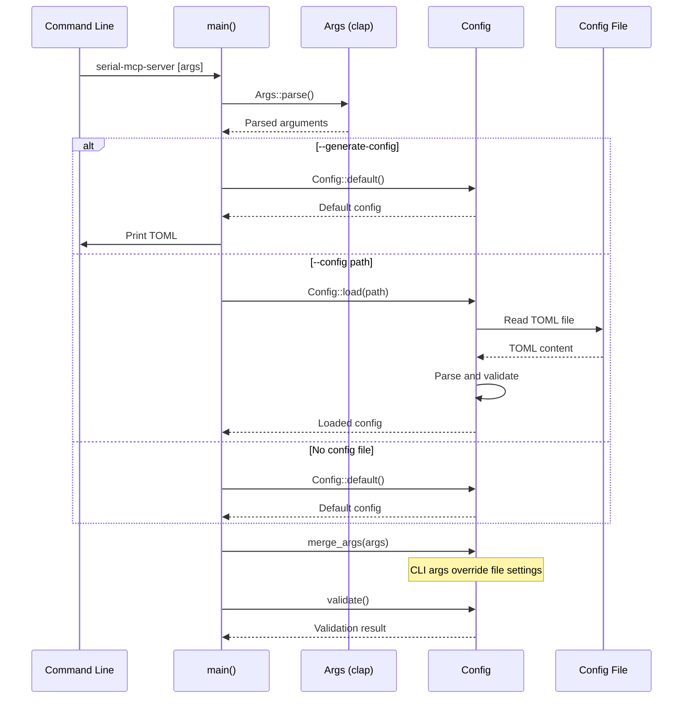
```mermaid
sequenceDiagram
    participant CLI as Command Line
    participant Main as main()
    participant Args as Args (clap)
    participant Config as Config
    participant File as Config File

    CLI->>Main: serial-mcp-server [args]
    Main->>Args: Args::parse()
    Args-->>Main: Parsed arguments

    alt --generate-config
        Main->>Config: Config::default()
        Config-->>Main: Default config
        Main->>CLI: Print TOML
    else --config path
        Main->>Config: Config::load(path)
        Config->>File: Read TOML file
        File-->>Config: TOML content
        Config->>Config: Parse and validate
        Config-->>Main: Loaded config
    else No config file
        Main->>Config: Config::default()
        Config-->>Main: Default config
    end

    Main->>Config: merge_args(args)
    Note over Config: CLI args override file settings
    Main->>Config: validate()
    Config-->>Main: Validation result
```

---

## Tool Implementation Details

### Tool Parameter Schemas

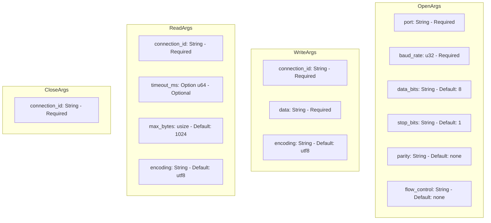
```mermaid
graph TD
    subgraph "OpenArgs"
        OA_PORT["port: String - Required"]
        OA_BAUD["baud_rate: u32 - Required"]
        OA_DATA["data_bits: String - Default: 8"]
        OA_STOP["stop_bits: String - Default: 1"]
        OA_PAR["parity: String - Default: none"]
        OA_FLOW["flow_control: String - Default: none"]
    end

    subgraph "WriteArgs"
        WA_ID["connection_id: String - Required"]
        WA_DATA["data: String - Required"]
        WA_ENC["encoding: String - Default: utf8"]
    end

    subgraph "ReadArgs"
        RA_ID["connection_id: String - Required"]
        RA_TO["timeout_ms: Option u64 - Optional"]
        RA_MAX["max_bytes: usize - Default: 1024"]
        RA_ENC["encoding: String - Default: utf8"]
    end

    subgraph "CloseArgs"
        CA_ID["connection_id: String - Required"]
    end
```

### Port Discovery Process

```mermaid
sequenceDiagram
    participant Client as MCP Client
    participant Handler as SerialHandler
    participant PortInfo as PortInfo
    participant SerialPort as serialport crate
    participant OS as Operating System

    Client->>Handler: list_ports()
    Handler->>PortInfo: list_ports()
    PortInfo->>SerialPort: available_ports()
    SerialPort->>OS: Enumerate serial devices
    OS-->>SerialPort: Device list

    loop For each port
        SerialPort-->>PortInfo: SerialPortInfo
        PortInfo->>PortInfo: Extract hardware_id

        alt USB Port
            PortInfo->>PortInfo: Format VID/PID
        else PCI Port
            PortInfo->>PortInfo: Mark as PCI
        else Bluetooth
            PortInfo->>PortInfo: Mark as Bluetooth
        else Unknown
            PortInfo->>PortInfo: Mark as Unknown
        end

        PortInfo->>PortInfo: Get description
    end

    PortInfo-->>Handler: Vec of PortInfo
    Handler->>Handler: Format port list string
    Handler-->>Client: CallToolResult with port info
```

### Connection ID Management

```mermaid
graph LR
    subgraph "ID Generation"
        UUID["UUID v4"]
        GEN["Uuid::new_v4()"]
        STR["to_string()"]
    end

    subgraph "Storage"
        MAP["HashMap: String to Arc Connection"]
    end

    subgraph "Lookup"
        GET["get(id)"]
        FOUND{"Found?"}
        RET["Return Arc clone"]
        ERR["InvalidConnection"]
    end

    GEN --> STR
    STR --> MAP

    GET --> MAP
    MAP --> FOUND
    FOUND -->|Yes| RET
    FOUND -->|No| ERR
```

---

## Shutdown Sequence

```mermaid
sequenceDiagram
    participant Signal as SIGINT/SIGTERM
    participant Main as main()
    participant Service as MCP Service
    participant Handler as SerialHandler
    participant CM as ConnectionManager
    participant Conns as Connections

    Signal->>Main: Ctrl+C or shutdown
    Main->>Main: tokio select triggered

    alt Service completed
        Service-->>Main: waiting() returned
    else Signal received
        Signal-->>Main: ctrl_c() triggered
    end

    Main->>Main: Log Cleaning up resources
    Main->>Handler: connection_manager()
    Handler-->>Main: Arc ConnectionManager
    Main->>CM: close_all()

    CM->>CM: Write lock connections
    loop For each connection
        CM->>Conns: Remove from HashMap
        Note over Conns: Connection dropped
    end
    CM-->>Main: closed_count

    Main->>Main: Log shutdown complete
    Main-->>Signal: Exit 0
```

---

## Performance Characteristics

### Latency Profile

| Operation | Typical Latency | Notes |
|-----------|-----------------|-------|
| list_ports | 1-10ms | OS enumeration |
| open | 10-100ms | Port negotiation |
| write | 1-5ms + baud delay | Depends on data size |
| read (with data) | 1-5ms | If data available |
| read (timeout) | timeout_ms | Blocking wait |
| close | sub-1ms | Resource cleanup |

### Resource Usage

```mermaid
graph TD
    subgraph "Per Connection"
        STREAM["SerialStream: approx 1KB"]
        MUTEX["Mutex overhead: approx 64 bytes"]
        COUNTERS["Statistics: approx 32 bytes"]
        UUID["Connection ID: approx 40 bytes"]
    end

    subgraph "Global"
        HASHMAP["Connection HashMap: approx 64 bytes per entry"]
        RWLOCK["RwLock overhead: approx 64 bytes"]
        CONFIG["Config: approx 2KB"]
    end

    subgraph "Runtime"
        TOKIO["Tokio runtime: Thread pool"]
        STDIO["stdio buffers: approx 8KB each"]
    end
```

---

## Platform-Specific Behavior

### Port Naming Conventions

```mermaid
graph LR
    subgraph "Windows"
        WIN["COM1, COM3, COM19"]
    end

    subgraph "Linux"
        LIN["/dev/ttyUSB0, /dev/ttyACM0, /dev/ttyS0"]
    end

    subgraph "macOS"
        MAC["/dev/tty.usbserial-XXXX, /dev/cu.usbmodem-XXXX"]
    end

    WIN --> |serialport-rs| UNIFIED["Unified API"]
    LIN --> |serialport-rs| UNIFIED
    MAC --> |serialport-rs| UNIFIED
```

### USB-to-Serial Chip Support

| Chip | Vendor ID | Common Use |
|------|-----------|------------|
| CH340/CH341 | 0x1A86 | Arduino clones |
| CH343 | 0x1A86 | High-speed USB-UART |
| FTDI FT232 | 0x0403 | Professional adapters |
| CP2102 | 0x10C4 | ESP32/ESP8266 |
| PL2303 | 0x067B | Legacy adapters |

---

## Appendix: Message Format Examples

### MCP Tool Call (Open)

```json
{
  "jsonrpc": "2.0",
  "id": 1,
  "method": "tools/call",
  "params": {
    "name": "open",
    "arguments": {
      "port": "COM19",
      "baud_rate": 115200,
      "data_bits": "8",
      "stop_bits": "1",
      "parity": "none",
      "flow_control": "none"
    }
  }
}
```

### MCP Tool Response (Open Success)

```json
{
  "jsonrpc": "2.0",
  "id": 1,
  "result": {
    "content": [
      {
        "type": "text",
        "text": "Serial connection opened\nConnection ID: a1b2c3d4-e5f6-7890-abcd-ef1234567890\nPort: COM19\nBaud rate: 115200"
      }
    ],
    "isError": false
  }
}
```

### MCP Tool Call (Write with Hex Data)

```json
{
  "jsonrpc": "2.0",
  "id": 2,
  "method": "tools/call",
  "params": {
    "name": "write",
    "arguments": {
      "connection_id": "a1b2c3d4-e5f6-7890-abcd-ef1234567890",
      "data": "48 65 6c 6c 6f",
      "encoding": "hex"
    }
  }
}
```
